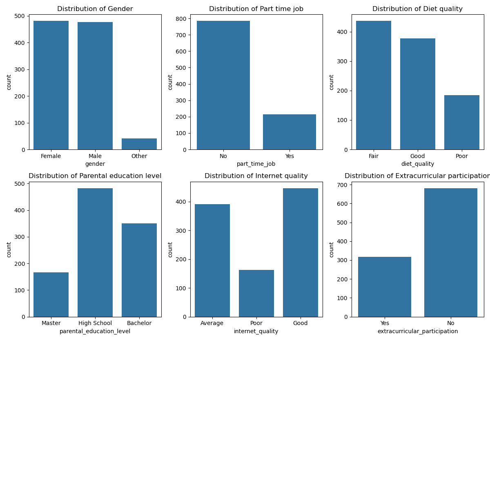
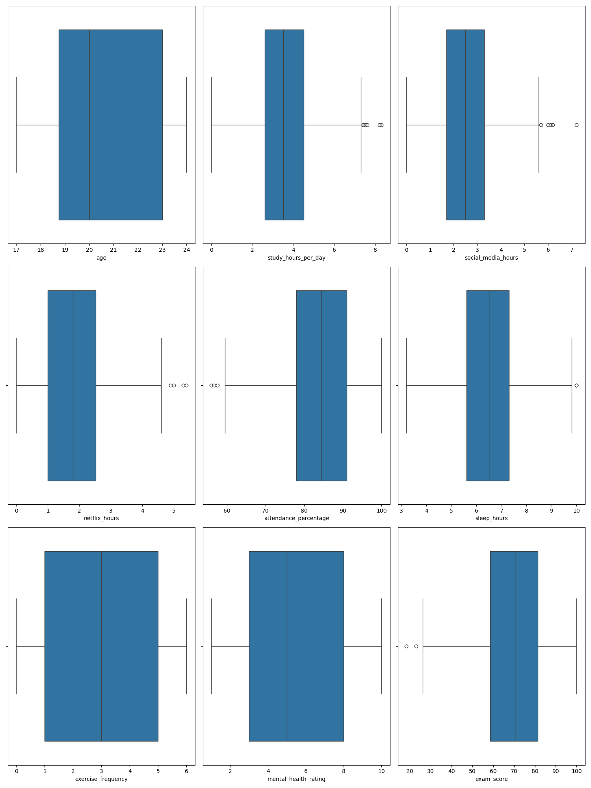
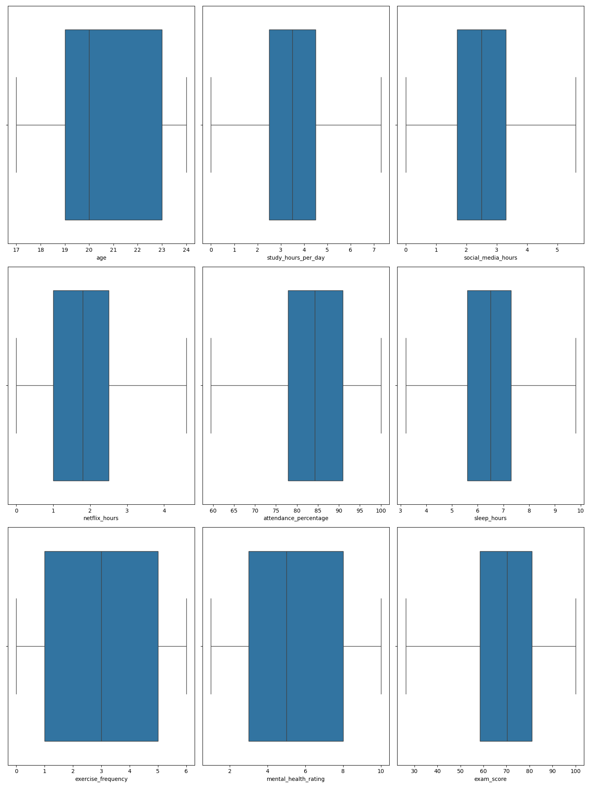

# Detecção de outliers

## Dicionário da Base de Dados

| Nome da Variável | Tipo | Descrição | Unidade | Valores Presentes | Observações |
|-----|-|---|---|---|---|
| student_id | str | Identificador do aluno | - | S1XXX | Chave primária |
| age | int64 | Idade do aluno | Anos | 17 - 24 | - |
| gender | str | Gênero do aluno | - | Female, Male, Other | - |
| study_hours_per_day | float64 | Horas estudadas por dia | Horas | 0.0 - 8.3 | - |
| social_media_hours | float64 | Horas de mídias sociais | Horas | 0.0 - 7.2 | - |
| netflix_hours | float64 | Horas de netflix | Horas | 0.0 - 5.4 | - |
| part_time_job | str | Se o aluno trabalha | - | No, Yes | - |
| attendance_percentage | float64 | Porcentagem de presença | Presença/Total de Aulas (porcentagem) | 56.0 - 100.0 | - |
| sleep_hours | float64 | Horas de sono | Horas | 3.2 - 10.0 | - |
| diet_quality | str | Qualidade nutricional | - | Fair, Good, Poor | - |
| exercise_frequency | int64 | Frequência de exercícios | - | 0 - 6 | - |
| parental_education_level | str | Nível de edução dos pais | - | Master, High School, Bachelor, nan | - |
| internet_quality | str | Qualidade interna | - | Average, Poor, Good | - |
| mental_health_rating | int64 | Nível de saúde mental | - | 1 - 10 | Variável de teste |
| extracurricular_participation | str | Participa de atividades extra curriculares | - | Yes, No | - |
| exam_score | float64 | Pontuação nos testes | - | 18.4 - 100.0 | Mede o desempenho curricular do aluno |

## Processo Utilizado

O código realiza a remoção de outliers utilizando o método do **Intervalo Interquartil (IQR)**.

1. **Cálculo dos Quartis**: Para cada variável numérica, calcula-se o primeiro quartil (Q1 - 25º percentil) e o terceiro quartil (Q3 - 75º percentil).

2. **Cálculo do IQR**: O Intervalo Interquartil é a diferença entre Q3 e Q1 (IQR = Q3 - Q1).

3. **Definição dos Limites**:
   - Limite inferior: Q1 - 1.5 × IQR
   - Limite superior: Q3 + 1.5 × IQR

4. **Filtragem dos Dados**: São mantidas apenas as observações que estão dentro deste intervalo [limite inferior, limite superior] para cada variável.

## Resultados

As variáveis que tiveram outliers removidos foram:

| Variável | Linhas Originais | Linhas Restantes | Linhas Removidas | % Removida |
|-------------|--------------|---------------|----------------|----------|
| study_hours_per_day | 1000 | 993 | 7 | 0.7% |
| social_media_hours | 993 | 988 | 5 | 0.5% |
| netflix_hours | 988 | 984 | 4 | 0.4% |
| attendance_percentage | 984 | 981 | 3 | 0.3% |
| sleep_hours | 981 | 979 | 2 | 0.2% |
| exam_score | 979 | 977 | 2 | 0.2% |

**Total de linhas removidas do dataset:** 23 (2.30%)


## Código remoção e detecção de outliers 
```python
df_processed = df.copy()
for col in numerical_cols.columns:
    Q1 = df_processed[col].quantile(0.25)
    Q3 = df_processed[col].quantile(0.75)
    IQR = Q3 - Q1

    lower_bound = Q1 - 1.5 * IQR
    upper_bound = Q3 + 1.5 * IQR

    df_processed = df_processed[(df_processed[col] >= lower_bound) & (df_processed[col] <= upper_bound)]
```

## Histograma das variáveis categóricas


## Boxplot das variáveis numéricas com outliers


## Boxplot das variáveis numéricas sem outliers



Aluno: João Pedro Noronha de Moraes Souza

Base de dados: [Student Habits vs Academic Performance](https://www.kaggle.com/datasets/jayaantanaath/student-habits-vs-academic-performance/data)

Link: [https://www.kaggle.com/datasets/jayaantanaath/student-habits-vs-academic-performance/data](https://www.kaggle.com/datasets/jayaantanaath/student-habits-vs-academic-performance/data)

Link de todo o projeto de Aprendizado de Máquina: [aprendizado_de_maquina](https://github.com/jpnoronhaa/aprendizado_de_maquina)