# Pré-processamento dos dados

## Etapas

1. Codificação de varáveis categóricas

    Nesta etapa serão identificadas as varáveis categóricas da base de dados e também serão utilizadas técnicas de codificação. 

2. Detecção e remoção de outliers

    Nesta etapa serão aplicados métodos de detecção e remoção de outliers. Ao fim, um novo dataframe será gerado sem a presença dos outliers.

3. Normalização ou padronização

    Nesta etapa será aplicada um método de escalonamento para colocar os dados em uma mesma escala.


## Codificação de variáveis categóricas

São variáveis categóricas da base de dados:

| Nome da Variável              | Descrição                                  | Valores Presentes                  |
|-------------------------------|--------------------------------------------|------------------------------------|
| gender                        | Gênero do aluno                            | Female, Male, Other                |
| part_time_job                 | Se o aluno trabalha                        | No, Yes                            |
| diet_quality                  | Qualidade nutricional                      | Fair, Good, Poor                   |
| parental_education_level      | Nível de edução dos pais                   | Master, High School, Bachelor, nan |
| internet_quality              | Qualidade de internet                      | Average, Poor, Good                |
| extracurricular_participation | Participa de atividades extra curriculares | Yes, No                            |


Antes da codificação das variáveis categóricas, algumas linhas estão com campo parental_education_level não preenchido. Para resolver o problema, estes campos serão preenchidos com o valor 'High School' pelo método `fill_parental_education_level`. Este é seu código:

```python
def fill_parental_education_level(df):
  df['parental_education_level'].fillna(value='High School', inplace=True)
  return None
```

A **codificação por frequência** será utilizada nas variáveis `gender`, `part_time_job` e `extracurricular_participation`. Este é o código da função:

```python
def frequency_encoding(df, columns):
  df_encoded = df.copy()
  frequency_maps = {}
  
  for col in columns:
    freq = df[col].value_counts(normalize=True)
    
    df_encoded[col] = df[col].map(freq)
    
    frequency_maps[col] = freq.to_dict()
  
  return df_encoded, frequency_maps
```

A técnica **OrdinalEncoder** é utilizada nas variáveis `diet_quality`, `parental_education_level` e `internet_quality`. Este é o código principal:

```python
def aplicar_ordinal_encoder(df, colunas_categoricas):  
  df_codificado = df.copy()
  encoder = OrdinalEncoder()
  df_codificado[colunas_categoricas] = encoder.fit_transform(df[colunas_categoricas])
  
  mapeamentos = {}
  for i, coluna in enumerate(colunas_categoricas):
    mapeamentos[coluna] = {categoria: idx for idx, categoria in enumerate(encoder.categories_[i])}
  
  return df_codificado, mapeamentos
```

## Detecção e remoção de outliers

São utilizados 3 métodos para a detecção e remoção de outliers: IQR, zscore e por frequência.

Abaixo segue o código em python das funções:

```python
def remove_outliers_iqr(df, numeric_columns, threshold=1.5):
  df_clean = df.copy()
  outlier_stats = {}
  
  for col in numeric_columns:
    Q1 = df_clean[col].quantile(0.25)
    Q3 = df_clean[col].quantile(0.75)
    IQR = Q3 - Q1
    
    lower_bound = Q1 - threshold * IQR
    upper_bound = Q3 + threshold * IQR
    
    outliers = df_clean[(df_clean[col] < lower_bound) | (df_clean[col] > upper_bound)]
    outlier_count = len(outliers)
    
    outlier_stats[col] = {
      'outlier_count': outlier_count,
      'percent_outliers': (outlier_count / len(df)) * 100,
      'lower_bound': lower_bound,
      'upper_bound': upper_bound,
      'min_value': df_clean[col].min(),
      'max_value': df_clean[col].max()
    }
    
    df_clean = df_clean[(df_clean[col] >= lower_bound) & (df_clean[col] <= upper_bound)]
  
  return df_clean, outlier_stats

def remove_ordinal_outliers_zscore(df, ordinal_columns, z_threshold=3):
  df_clean = df.copy()
  outlier_stats = {}
  
  for col in ordinal_columns:
    mean = df_clean[col].mean()
    std = df_clean[col].std()
    
    z_scores = np.abs((df_clean[col] - mean) / std)
    
    outliers = df_clean[z_scores > z_threshold]
    outlier_count = len(outliers)
    
    outlier_stats[col] = {
      'outlier_count': outlier_count,
      'percent_outliers': (outlier_count / len(df)) * 100,
      'z_threshold': z_threshold,
      'mean': mean,
      'std': std
    }
    
    df_clean = df_clean[z_scores <= z_threshold]
  
  return df_clean, outlier_stats

def remove_nominal_outliers_frequency(df, nominal_columns, freq_threshold=0.01):
  df_clean = df.copy()
  outlier_stats = {}
  
  for col in nominal_columns:
    freq = df_clean[col].value_counts()
    
    rare_categories = freq[freq < freq_threshold].index
    outliers = df_clean[df_clean[col].isin(rare_categories)]
    outlier_count = len(outliers)
    
    outlier_stats[col] = {
      'outlier_count': outlier_count,
      'percent_outliers': (outlier_count / len(df)) * 100,
      'freq_threshold': freq_threshold,
      'rare_categories': list(rare_categories),
      'category_counts': df[col].value_counts().to_dict()
    }
    
lean[col].isin(rare_categories)]
  
  return df_clean, outlier_stats
```

## Normalização dos dados 

Para normalização dos dados é utilizado o MinMaxScaler, já que os outliers foram removidos na etapa anterior. O Código da função está logo abaixo.

```python
def min_max_normalization(df, columns, feature_range=(0, 1)):
  df_norm = df.copy()
  scaler = MinMaxScaler(feature_range=feature_range)
  normalization_params = {}

  df_norm[columns] = scaler.fit_transform(df[columns])

  for i, col in enumerate(columns):
    normalization_params[col] = {
      'min_original': scaler.data_min_[i],
      'max_original': scaler.data_max_[i],
      'min_scaled': feature_range[0],
      'max_scaled': feature_range[1]
    }

  return df_norm, normalization_params
```

## Resultados

Apresentação das visualizações geradas durante o processamento dos dados dos estudantes, mostrando comparações entre os dados originais e processados.

### 1. Tratamento de Outliers

#### 1.1. Outliers Numéricos
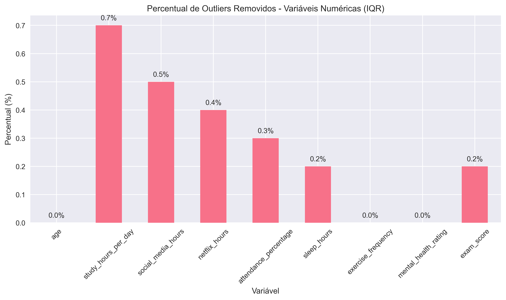{ width=90% }

**Descrição**: Percentual de outliers removidos em variáveis numéricas usando o método IQR (Intervalo Interquartil).

#### 1.2. Outliers Ordinais
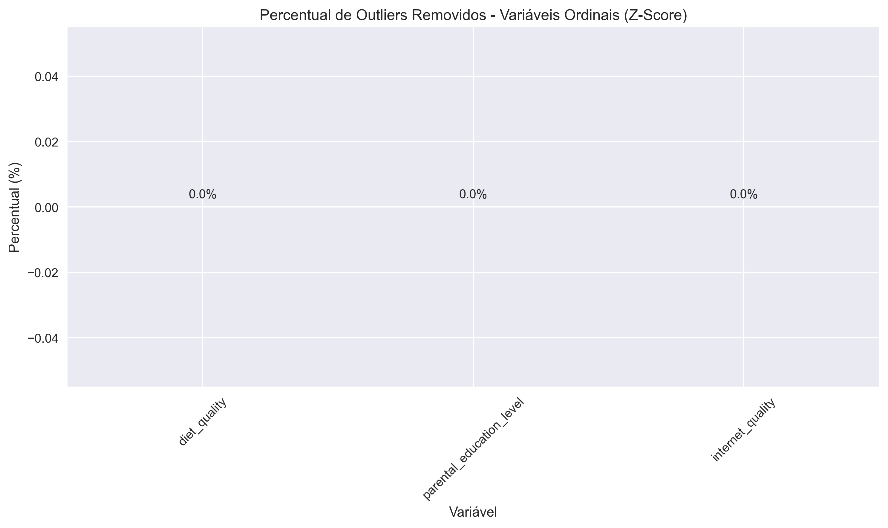{ width=90% }
  
**Descrição**: Percentual de outliers removidos em variáveis ordinais usando o método Z-Score.

#### 1.3. Outliers Nominais
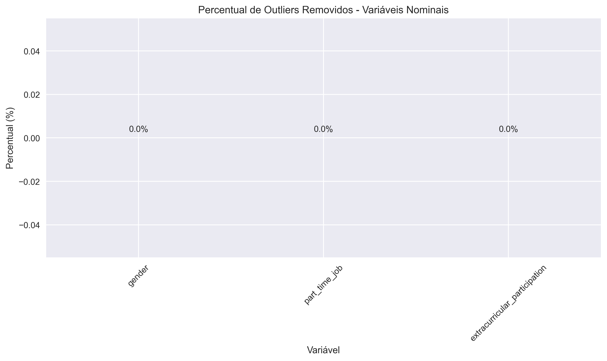{ width=90% }
  
**Descrição**: Percentual de outliers removidos em variáveis nominais baseado em frequência.

### 2. Comparação de Variáveis Numéricas

#### 2.1. Desempenho Acadêmico
{ width=90% }
  
**Descrição**: Distribuição das notas de exame antes e após o processamento.

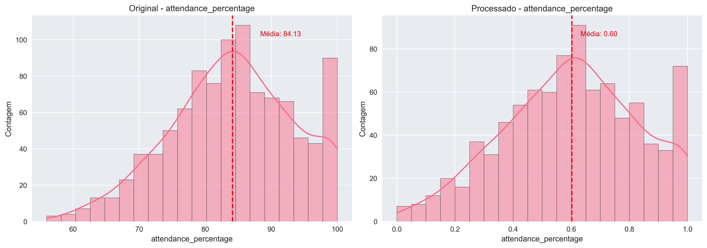{ width=90% }
  
**Descrição**: Distribuição da porcentagem de frequência às aulas.

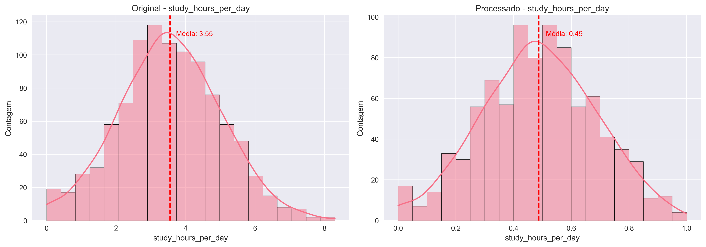{ width=90% }
  
**Descrição**: Distribuição das horas de estudo diárias.

#### 2.2. Hábitos Digitais
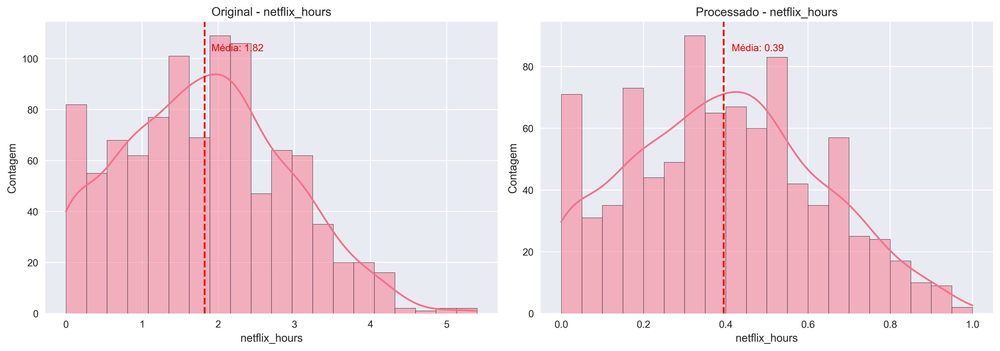{ width=90% }
  
**Descrição**: Distribuição das horas gastas no Netflix.

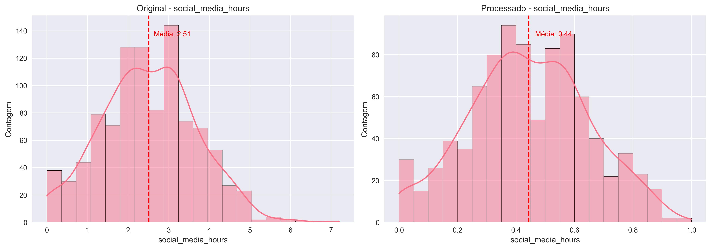{ width=90% }
  
**Descrição**: Distribuição das horas gastas em mídias sociais.

#### 2.3. Saúde e Bem-estar
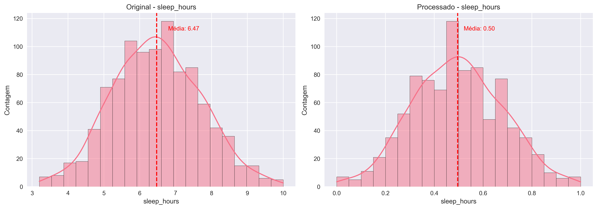{ width=90% }
  
**Descrição**: Distribuição das horas de sono por noite.

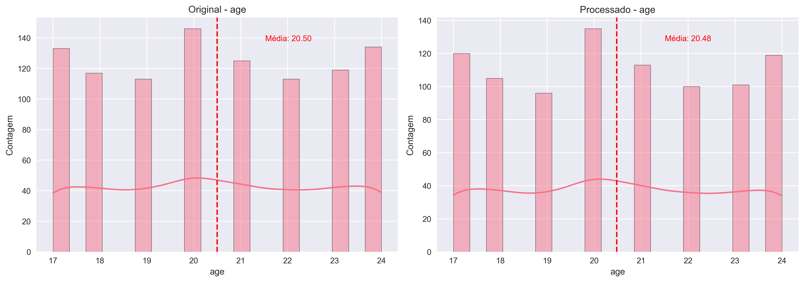{ width=90% }
  
**Descrição**: Distribuição das idades dos estudantes.

### 3. Comparação de Variáveis Categóricas

#### 3.1. Variáveis Nominais
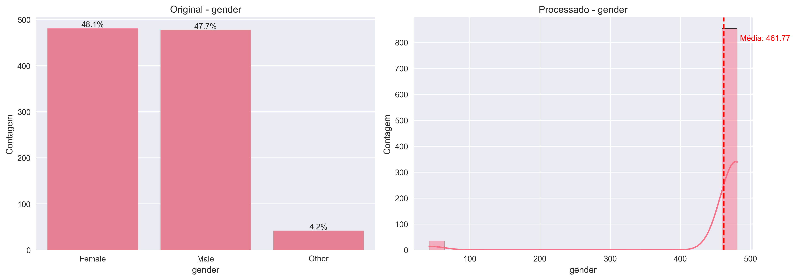{ width=90% }
  
**Descrição**: Distribuição por gênero dos estudantes.

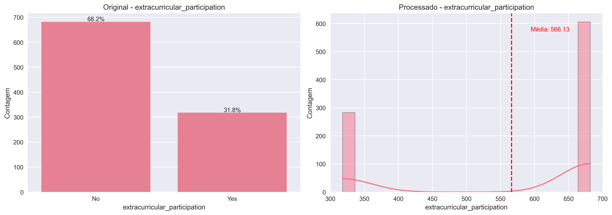{ width=90% }
  
**Descrição**: Participação em atividades extracurriculares.

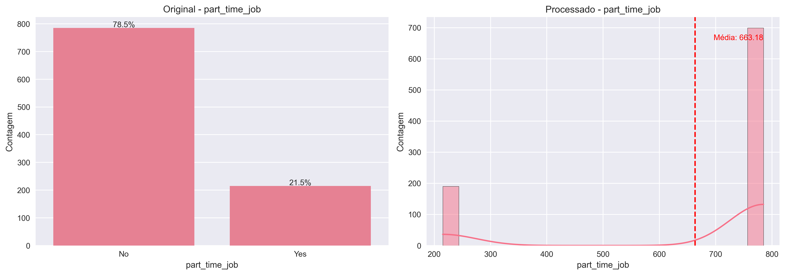{ width=90% }
  
**Descrição**: Distribuição de estudantes com trabalho de meio período.

#### 3.2. Variáveis Ordinais
{ width=90% }
  
**Descrição**: Distribuição do nível educacional dos pais.

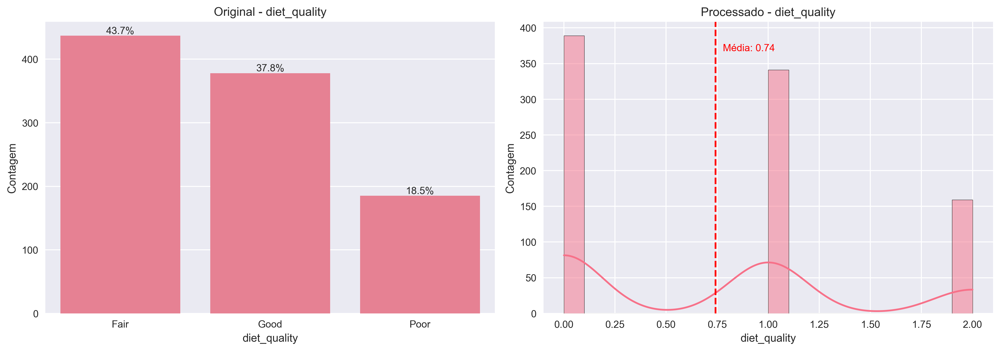{ width=90% }
  
**Descrição**: Autoavaliação da qualidade da dieta dos estudantes.

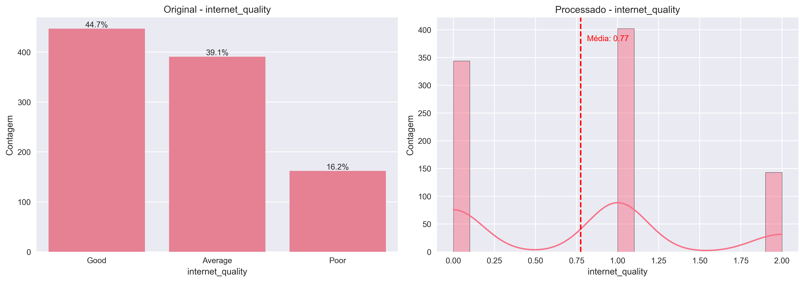{ width=90% }
  
**Descrição**: Percepção da qualidade da conexão de internet.

### 4. Análise de Frequência de Variáveis Ordinais

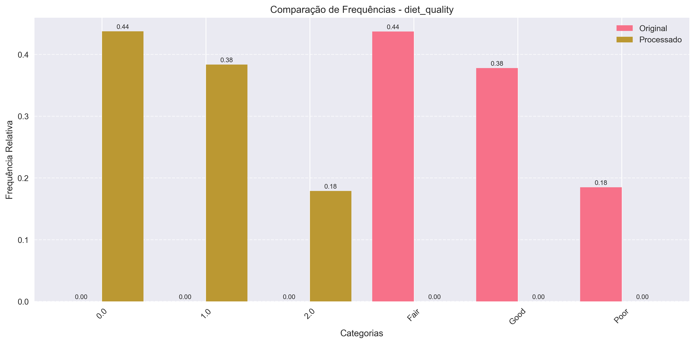{ width=90% }
  
**Descrição**: Comparação das frequências relativas das categorias de qualidade da dieta.

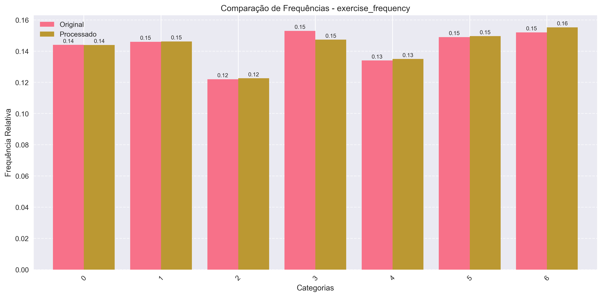{ width=90% }
  
**Descrição**: Comparação das frequências relativas da frequência de exercícios físicos.

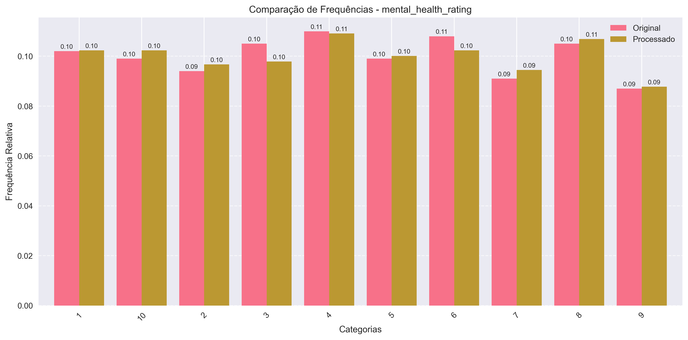{ width=90% }
  
**Descrição**: Comparação das frequências relativas da autoavaliação de saúde mental.

### 5. Normalização de Variáveis Numéricas

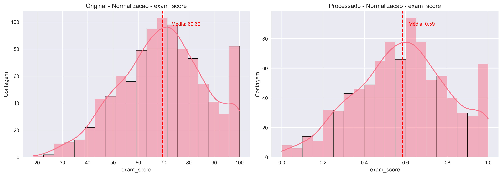{ width=90% }

**Descrição**: Comparação da distribuição das notas de exame antes e após normalização.

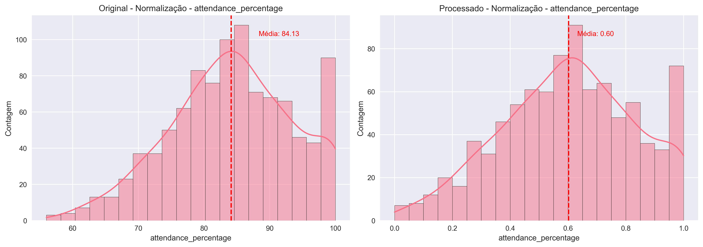{ width=90% }
  
**Descrição**: Comparação da distribuição da frequência antes e após normalização.

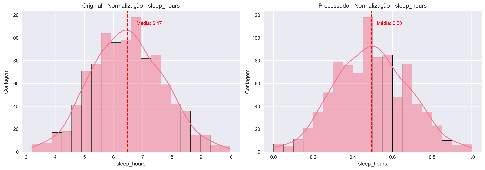{ width=90% }
  
**Descrição**: Comparação da distribuição das horas de sono antes e após normalização.

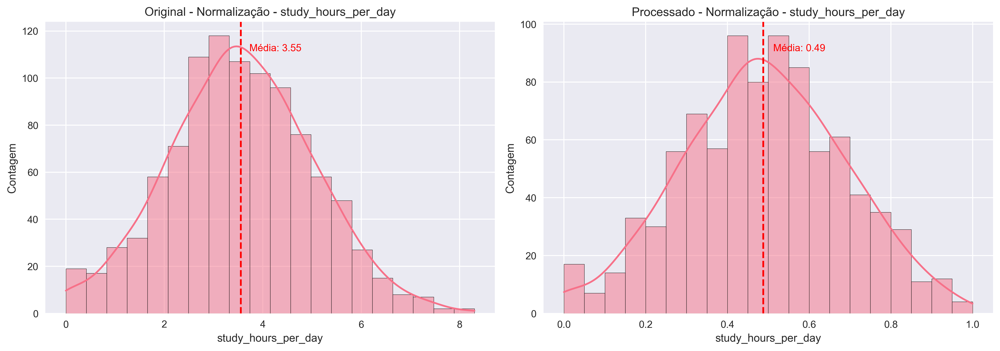{ width=90% }
  
**Descrição**: Comparação da distribuição das horas de estudo antes e após normalização.

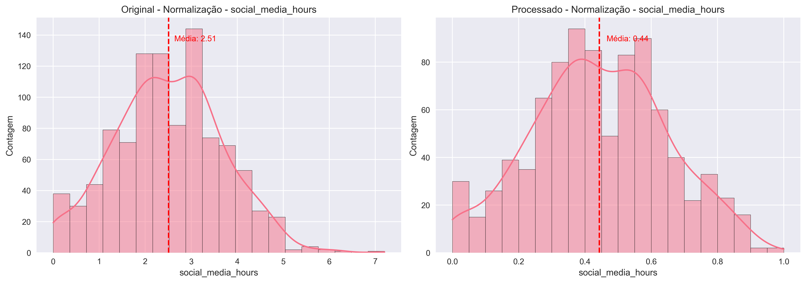{ width=90% }
  
**Descrição**: Comparação da distribuição do tempo em mídias sociais antes e após normalização.

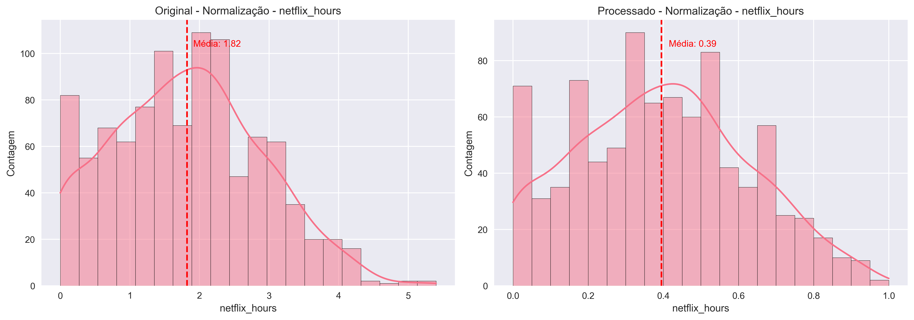{ width=90% }
  
**Descrição**: Comparação da distribuição do tempo no Netflix antes e após normalização.


----

Aluno: João Pedro Noronha de Moraes Souza

Base de dados: [Student Habits vs Academic Performance](https://www.kaggle.com/datasets/jayaantanaath/student-habits-vs-academic-performance/data)

Link: [https://www.kaggle.com/datasets/jayaantanaath/student-habits-vs-academic-performance/data](https://www.kaggle.com/datasets/jayaantanaath/student-habits-vs-academic-performance/data)

Link de todo o projeto de Aprendizado de Máquina: [aprendizado_de_maquina](https://github.com/jpnoronhaa/aprendizado_de_maquina)